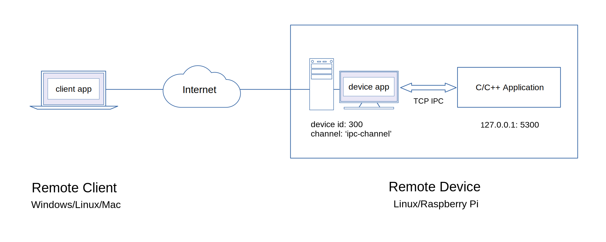

## Watch Data from Remote C/C++ Application through IPC
[](https://raw.githubusercontent.com/EdoLabs/src2/master/quicktour3.svg?sanitize=true)


In this quick tour, the client will attempt to send and capture data from a C/C++ application through inter-process communication (ipc) using *tcp* with the remote device.

The remote device will send a *json* payload data { type:"random", source:"cpp-server" } to capture the random value from the C/C++ application.

We will use the nlohmann-json (https://github.com/nlohmann/json) library for *json* data interchange with C/C++ application.

#### Remote Device Setup

##### 1. Create a device project directory and install m2m inside the directory.
```js
$ npm install m2m
```
##### 2. Save the code below as device.js in your device project directory.
```js
'use strict';

const net = require('net');
const { Device } = require('m2m');

const device = new Device(300);

device.connect(() => {

  device.setData('ipc-channel', (data) => {

    let pl = JSON.stringify({type:'random', source:'cpp-server'});

    TcpClient('127.0.0.1', 5300, pl, (err, d) => {
      if(err) return console.error('TcpClient error:', err.message);
      if(d){
        data.send(d);
      }
    });
  });

});

function TcpClient(ip, port, payload, cb){
  const client = new net.Socket();
  client.connect(port, ip);

  client.setEncoding('utf8');

  client.on("connect", () => {
    if(payload){
      client.write(payload);
    }
  });

  client.on('error', (error) => {
    console.log("Tcp client socket error:", error);
    if(error && cb){
      cb(error, null);
    }
    client.destroy();
  });

  client.on("data", (data) => {		
    if(cb){
      setImmediate(cb, null, data);
    }
    client.end();
  });

  client.on("close", (error) => {
    if(error && cb){
      console.log("Tcp client socket is closed:", error);
      cb(error, null);
    }
  });

  client.on("end", (error) => {
    if(error && cb){
      console.log("Tcp client socket connection is terminated:", error);
      cb(error, null);
    }
    client.unref();
  });
};
```
##### 3. Start your device application.
```js
$ node device.js
```

#### C/C++ Application Setup on Remote Device

##### 1. Download the *cpp-ipc-application-demo* example project.
```js
$ git clone https://github.com/EdAlegrid/cpp-ipc-application-demo.git
```
Check the *main.cpp* source file inside the *cpp-ipc-application-demo/app* sub-directory as shown below.
```js
/*
 * File:   main.ccp
 * Author: Ed Alegrid
 *
 * Use any Linux C++11 compliant compiler or IDE.
 *
 */

#include <string>  
#include <memory>
#include <iostream>
#include <nlohmann/json.hpp>
#include "tcp/server.h"

using namespace std;
using json = nlohmann::json;

int main()
{
  cout << "\n*** Remote C/C++ Application ***\n" << endl;

  int port = 5300;
  auto server = make_shared<Tcp::Server>(port);

  for (;;)
  {
      // listen for new client connection
      // set socket listener to true for continous loop
      server->socketListen(true);

      // generate random number 1 ~ 100
      int rn = rand() % 100 + 1;

      // read data from client
      auto data = server->socketRead();
      cout << "rcvd client data: " << data << endl;

      // parse received json data
      try{
        auto j = json::parse(data);

        if(j["source"] == "cpp-server"){
          j["value"] = rn;
          cout << "send back json data: " << server->socketWrite(j.dump()) << endl;
        }
        else{
          cout << "send back invalid json data: " << server-> socketWrite("invalid json data") << endl;
        }
      }
      catch (json::parse_error& ex)
      {
        cerr << "parse error at byte " << ex.byte << endl;
        cout << "send back string data: " << server->socketWrite(data) << endl;
      }

      cout << "waiting for client data ...\n\n";
      server->socketClose();
  }
  return 0;
}
```
##### 2. Install nlohmann-json library for *json* data interchange.  
```js
$ sudo apt-get install nlohmann-json3-dev
```
##### 3. Compile the *main.cpp* source file inside of the *cpp-ipc-application-demo/app* sub-directory.
```js
$ cd cpp-ipc-application-demo/app
```
Make sure you are inside the app sub-directory.
```js
$ g++ -Wall -g -o bin/main main.cpp -pthread
```
##### 3. Run the main application.
```js
$ ./bin/main
```
Once the C/C++ Application is up and running, you should see a server output as shown below.
```js
*** Remote C/C++ Application ***

Server listening on: 127.0.0.1:5300
```
#### Remote Client Setup

##### 1. Create a client project directory and install m2m.
```js
$ npm install m2m
```
##### 2. Save the code below as client.js in your client project directory.
```js
const { Client } = require('m2m');

let client = new Client();

client.connect(() => {

  client.watch({id:300, channel:'ipc-channel'}, (data) => {  
    try{
      let jd = JSON.parse(data);
      console.log('rcvd json data:', jd);
    }
    catch (e){
      console.log('rcvd string data:', data);
    }
  });
  
});
```
##### 3. Run your client application.
```js
$ node client.js
```
The client should receive a *json* data with a random value similar below.

*rcvd json data: { type: 'random', source: 'cpp-server', value: 16 }*
